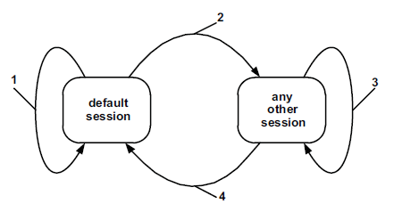

# 9 诊断和通信管理的功能单元

## 9.1 概览

表格22定义了诊断和通信管理的功能单元。

表格22

|服务|描述|
|:--|:--|
|诊断会话控制 |客户端向服务端请求控制诊断会话 |
|ECU复位     |客户端强制服务端执行复位      |
|安全访问     |客户端请求解锁安全服务      |
|通讯控制|客户端使用这个服务控制通信参数配置(如：通信波特率)|
|测试信号保持|客户端向服务端表明它仍然存在|
|时间相关参数入口| 客户端使用该服务读取/修改一个活跃通信的时间相关参数|
|安全数据传输| 客户端使用此服务以扩展数据链接安全性进行数据传输|
|控制DTC设置| 客户端控制DTC的设置|
|时间响应|客户端请求建立和/或控制事件机制|
|链接控制|客户端请求控制通信波特率 |

## 9.2 诊断会话控制(0x10)服务

### 9.2.1服务说明

诊断会话控制服务用于启用不同的诊断会话。

一个诊断会话支持一个特定的诊断服务或者会话中的功能。该服务提供了子服务可以报告数据链路层特定参数值的能力，这些参数值对于启用的诊断会话(例如时间参数值)是有效的。该国际标准的用户应定义在每个诊断会话中启用的服务和(或)功能的确切集合。

在服务器中总是有一个诊断会话是活跃的。服务器在启动时应始终启动默认诊断会话。如果没有启动其他诊断会话，则默认诊断会话应在服务器供电时运行。

在正常的操作条件下，以及在汽车制造商定义的其他操作条件下(如：跛行回家操作情景)，服务器应该能够提供诊断功能。

如果客户机请求一个已运行的诊断会话，则服务器应发送一个正响应消息，并按照图7所示的方式运行，它描述了在会话之间转换时服务器的内部行为。

每当客户机请求新的诊断会话时，服务器将在对这个新的会话激活计时之前，发送诊断会话控制的正响应回复。有些情况可能要求在发送响应之前必须输入新会话，而保持旧的协议计时以发送响应。如果服务器无法启动所请求的新诊断会话，则它将以诊断会话控制的负面响应消息进行响应，并且当前会话将继续(参见诊断会话参数定义，以了解关于服务器和客户机应如何行为的进一步信息)。非默认的诊断服务(不包括可编程会话)的诊断功能集和诊断会话是默认会话中提供的功能的超集，这意味着在切换到任何非缺省诊断会话时，也可以使用默认的诊断功能。一个会话可以使汽车制造商制定特定的服务和功能，这就不属于本文档的定义范畴了。

为了启动新的诊断会话，服务器可以要求满足某些条件。所有这些条件都是用户定义的。比如下面的例子：

——  该服务器可以只允许具有特定客户端标识符（客户端诊断地址）的客户端启动特定的新诊断会话（例如，服务器可能要求只有具有客户端标识符0xF4的客户端才可以启动扩展诊断会话）。

——  某些安全条件可能需要满足（例如，车辆不能移动或发动机不能运行）。

图7表示诊断会话转换的图示，以及服务端在会话切换时需要执行的操作：

